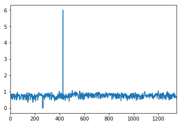
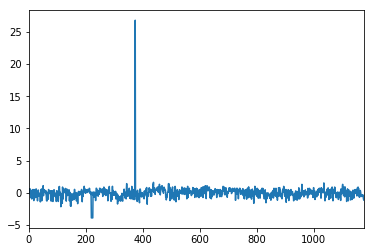
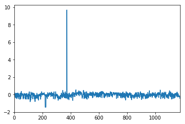
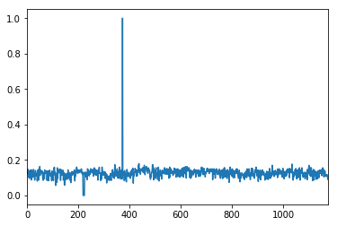
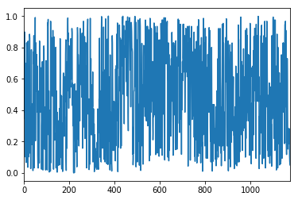

# Scalers and Outliers

UPDATE: perhaps a better guide is [from `scikit-learn`
docs](http://scikit-learn.org/stable/auto_examples/preprocessing/plot_all_scaling.html#sphx-glr-auto-examples-preprocessing-plot-all-scaling-py)

Need 0.19 for `QuantileTransformer()`

```python
import sklearn as sk

sk.__version__
```


    '0.19.0'


```python
# Equivalent to StandardScaler()  RobustScaler() MinMaxScaler() which have Estimator APIs
from sklearn.preprocessing import scale, robust_scale, minmax_scale
from sklearn.preprocessing import QuantileTransformer
```

# Raw data


```python
sl.x.plot()
```


    <matplotlib.axes._subplots.AxesSubplot at 0x1183a7cc0>





# Standard Scaler


```python
val = scale(sl.x)

pd.Series(val).plot()
```


    <matplotlib.axes._subplots.AxesSubplot at 0x11b73d9e8>





# Robust Scaler


```python
val = robust_scale(sl.x.values.reshape(-1, 1), quantile_range=(1, 99))

pd.Series(val[:,0]).plot()
```


    <matplotlib.axes._subplots.AxesSubplot at 0x1183e2cf8>





# MinMax Scaler


```python
val = minmax_scale(sl.x)
```


```python
pd.Series(val).plot()
```


    <matplotlib.axes._subplots.AxesSubplot at 0x11b85acc0>





# Quantile Transformer


```python
qt = QuantileTransformer()
val = qt.fit_transform(sl.x.values.reshape(-1,1))
```


```python
pd.Series(val[:,0]).plot()
```


    <matplotlib.axes._subplots.AxesSubplot at 0x11b7fd978>





```python

```
